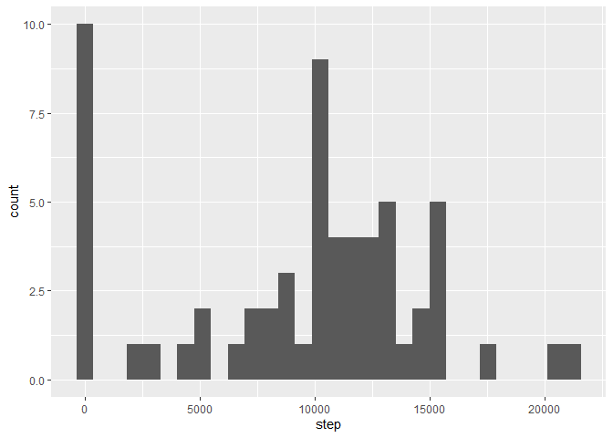
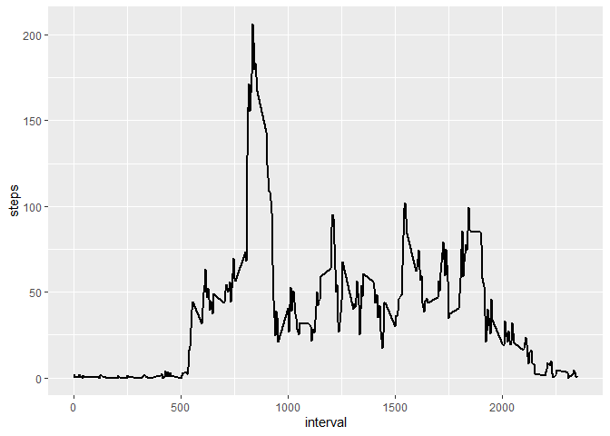
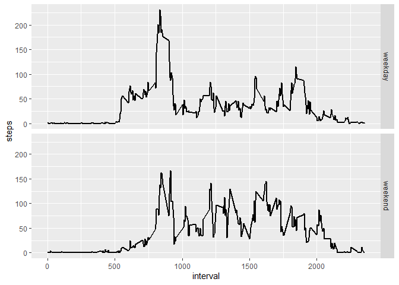

## Loading and preprocessing the data


```r
path <- getwd()
url <- "https://d396qusza40orc.cloudfront.net/repdata%2Fdata%2Factivity.zip"
download.file(url, file.path(path, "dataFiles.zip"))
unzip(zipfile = file.path(path, "dataFiles.zip"))
df<-read.csv("activity.csv")
```

## What is mean total number of steps taken per day?

```r
library(ggplot2)
df$date<-as.Date(df$date)
stepd<-tapply(df$steps,df$date,sum,na.rm=T)
stepd<-as.data.frame(stepd)  
names(stepd)<-c("step")
```


```r
ggplot(stepd,aes(x=step))+geom_histogram()
```

```
## `stat_bin()` using `bins = 30`. Pick better value with `binwidth`.
```

<!-- -->


```r
mean<-mean(stepd$step)
median<-median(stepd$step)
```
We remove NAs from the dataset
Therefore, the mean steps taken each day is 9354.2295082. The median steps taken each day is 10395

## What is the average daily activity pattern?


```r
stepi<-tapply(df$steps,df$interval,mean,na.rm=T)
stepi<-as.data.frame(stepi)   
stepi<-data.frame(interval=unique(df$interval),steps=stepi$stepi)
ggplot(stepi,aes(x=interval,y=steps))+geom_line(size=1.0)
```

<!-- -->

```r
int<-stepi[order(stepi$steps,decreasing = TRUE),][1,][1]
```
on average across all the days in the dataset, interval 835 contains the maximum number of steps

## Imputing missing values
There is a total of 2304 NAs in the dataset.  
I used the mean for that 5-minute interval to as the stratergy.  
New dataset is the newdf as below.

```r
u<-df[which(is.na(df$steps)),]
m<-merge(u,stepi,by="interval")
m<-data.frame(steps=m$steps.y,date=m$date,interval=m$interval)
m<-m[order(m$interval,m$date),]
newdf<-df
newdf[which(is.na(newdf$steps)),][order(u$interval,u$date),]<-m
```

#Histogram

```r
newstepd<-tapply(newdf$steps,newdf$date,sum,na.rm=T)
newstepd<-as.data.frame(stepd)  
names(newstepd)<-c("step")
ggplot(newstepd,aes(x=step))+geom_histogram()
```

```
## `stat_bin()` using `bins = 30`. Pick better value with `binwidth`.
```

<!-- -->


```r
newmean<-mean(newstepd$step)
newmedian<-median(newstepd$step)
```
Therefore, the new mean steps taken each day is 9354.2295082. The median new steps taken each day is 10395. It could been seen there is no impact  of imputing missing data on the estimates of the total daily number of steps.

## Are there differences in activity patterns between weekdays and weekends?


```r
newdf$days<-weekdays(newdf$date)
newdf$weekend<-"weekday"
newdf$weekend[newdf$days=="Saturday"|newdf$days=="Sunday"]<-"weekend"
newdf$weekend<-as.factor(newdf$weekend)
h<-split(newdf,newdf$weekend)
h1<-h$weekday
h2<-h$weekend

stepi1<-tapply(h1$steps,h1$interval,mean,na.rm=T)
stepi1<-as.data.frame(stepi1)   
stepi2<-tapply(h2$steps,h2$interval,mean,na.rm=T)
stepi2<-as.data.frame(stepi2)   

stepi1<-data.frame(interval=unique(h1$interval),steps=stepi1$stepi1,week="weekday")
stepi2<-data.frame(interval=unique(h2$interval),steps=stepi2$stepi2,week="weekend")
stepi<-rbind(stepi1,stepi2)


ggplot(stepi,aes(x=interval,y=steps))+geom_line(size=1.0)+facet_grid(week~.)
```

<!-- -->

So it could be seen above, that steps in weekdays are generally more in weekends. Besides, the variation in weekdays are larger than in weekend.
